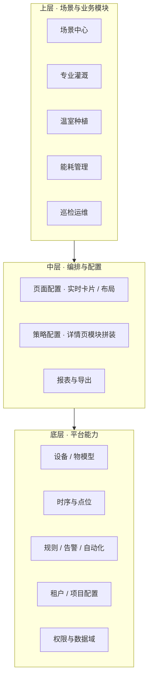

# IoT 统一 SaaS 平台 — 架构说明（Demo / 理思路）

## 1. 目标

构建**可承载多个专业场景**的通用 IoT SaaS：**底层能力统一**，**上层按场景模块化**。当前以**温室种植**为第一切入场景；后续可扩展到专业灌溉、水肥一体化、能耗管理、巡检运维等。

本仓库 `iot-unified-saas` 为**演示与架构骨架**：不接真实设备与现有 APP，仅用类型与假数据表达信息流与控制面边界。

## 2. 分层模型

- **底层（平台内核）**：设备接入与物模型、统一数据与时序、规则与告警、租户/项目级配置、权限与审计。各场景**复用**同一套抽象，差异通过「场景包」声明。
- **中层（配置与编排）**：**页面配置**决定 APP 实时页等界面上的**卡片、分组、组件类型与数据绑定**；**策略配置**决定点击卡片进入详情后**由哪些可复用区块拼装**（阈值、时段、联动、仅监视开关等）。
- **上层（场景）**：每个场景是一个 **ScenePackage**：包含 capability 声明、默认页面模板、默认策略模板、示意路由；可启用多场景并存（多租户/多项目维度由 CFG + RBAC 约束，本 Demo 只 mock）。

## 3. 与当前温室 APP 的映射（概念）

| APP 概念 | 平台抽象 |
|---------|---------|
| 项目详情 · 实时 · 卡片网格 | `PageSchema` → `cardInstances` + `layoutGroup` |
| 单指标卡片（温/湿/CO₂/VPD/灯光） | `CardDefinition` + `dataBindings` |
| 复合卡片（营养池/根区多指标） | `composite` 卡片 + 多 `metricSlot` |
| 卡片详情 / 设置页 | `StrategyPageSchema` → `sectionModules[]` |
| 告警角标 / 状态色 | `RuleEngine` 输出 + 卡片 `alarmDisplayPolicy`（Demo 用静态状态） |

## 4. 第一阶段范围（本 Demo 已实现）

1. **场景中心**：浏览场景包、能力标签、关联的页面/策略模板摘要。
2. **页面配置**：在温室场景下，对「实时页」卡片做启用/排序/分组预览（贴合 `APP` 中环境气候 / 根区等分区思路）。
3. **策略配置**：选择策略页（如温度、CO₂、灯光），勾选/排序**策略区块**（时段、目标、联动、回差等），表达「详情页模块化拼装」。

未做：真实 API、设备接入、规则执行、权限细粒度 UI。

## 5. 目录约定（代码）

| 路径 | 含义 |
|------|------|
| `src/platform/*` | 跨场景领域类型：设备、点位、规则、RBAC、页面/策略 schema |
| `src/scenes/*` | 场景注册表与温室等场景包定义 |
| `src/data/*` | Demo 假数据：遥测、默认 schema |
| `src/components/modules/*` | 三阶段主界面：场景中心、页面配置、策略配置 |

## 6. 后续扩展方式

- 新增场景：在 `src/scenes` 增加 `ScenePackage`，注册到 `registry`；可选覆盖默认 `PageSchema` / `StrategyTemplate`。
- 新增卡片类型：扩展 `CardType` 与 `cardRegistry`，由页面配置引用。
- 新增策略区块：扩展 `StrategySectionKind`，策略配置页即生成对应 `StrategyPageSchema`。

此文档随实现迭代可继续补充接口契约（OpenAPI / 事件总线）与多租户隔离策略。
